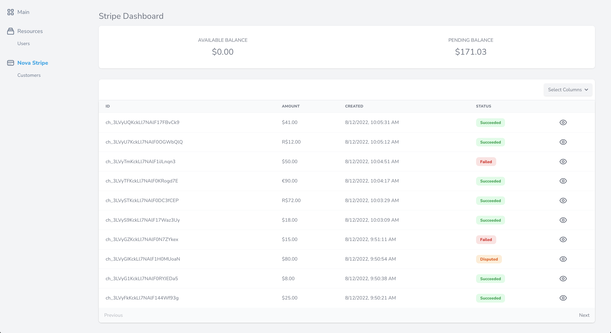
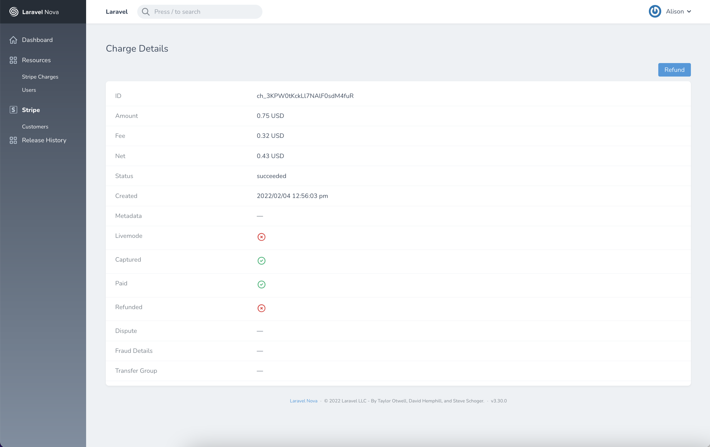

# Laravel Nova Stripe Dashboard

[](https://packagist.org/packages/tightenco/nova-stripe)
[](https://travis-ci.org/tightenco/nova-stripe)
[](https://packagist.org/packages/tightenco/nova-stripe)

This package makes it easy to see high-level information about your application's [Stripe](https://stripe.com/) balance and charges in a Nova dashboard.

If you are interested in managing your users' Stripe subscriptions with [Laravel Cashier](https://github.com/laravel/cashier), check out [Nova Cashier Manager](https://novapackages.com/packages/themsaid/nova-cashier-manager) by [themsaid](https://github.com/themsaid).

## Installation

You can install this package via [Composer](https://getcomposer.org/):

```bash
$ composer require tightenco/nova-stripe
```

## Usage

Add your Stripe key and secret values to your `.env` file:

```
STRIPE_KEY=
STRIPE_SECRET=
```

* https://stripe.com/docs/keys#obtain-api-keys

Add a `stripe` element to your `config/services.php` configuration file:

```php
'stripe' => [
    'key' => env('STRIPE_KEY'),
    'secret' => env('STRIPE_SECRET'),
],
```

Register the `NovaStripe` tool in `app/Providers/NovaServiceProvider`:

```php
public function tools()
{
    return [
        new \Tighten\NovaStripe\NovaStripe,
    ];
}
```

## Features

#### View Stripe charges dashboard



#### View Stripe charges details



## Contributing

Please see [CONTRIBUTING](CONTRIBUTING.md) for details.

### Security

If you discover any security related issues, please email hello@tighten.co instead of using the issue tracker.

## Credits

- [Samantha Geitz](https://github.com/samanthamichele7)
- [All Contributors](https://github.com/tightenco/nova-stripe/graphs/contributors)

## Support us

Tighten is a web development firm that works in Laravel, Vue, and React. You can learn more about us on our [web site](https://tighten.co/)

## License

The MIT License (MIT). Please see [License File](LICENSE.md) for more information.
