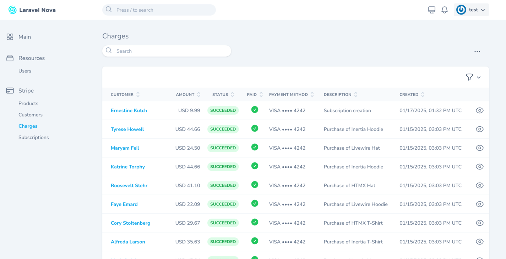

# Laravel Nova Stripe Dashboard

[](https://packagist.org/packages/tightenco/nova-stripe)
[](https://packagist.org/packages/tightenco/nova-stripe)

This package makes it easy to see high-level information about your application's [Stripe](https://stripe.com/) balance, charges, subscriptions and customers in a Nova dashboard.

If you are interested in managing your users' Stripe subscriptions with [Laravel Cashier](https://github.com/laravel/cashier), check out [Nova Cashier Manager](https://novapackages.com/packages/themsaid/nova-cashier-manager) by [themsaid](https://github.com/themsaid).

## Installation

You can install this package via [Composer](https://getcomposer.org/):

```bash
$ composer require tightenco/nova-stripe
```

## Usage

Add your Stripe key and secret values to your `.env` file:

```
STRIPE_KEY=
STRIPE_SECRET=
```

* https://stripe.com/docs/keys#obtain-api-keys

Add a `stripe` element to your `config/services.php` configuration file:

```php
'stripe' => [
    'key' => env('STRIPE_KEY'),
    'secret' => env('STRIPE_SECRET'),
],
```

Register the `NovaStripe` tool in `app/Providers/NovaServiceProvider`:

```php
public function tools()
{
    return [
        new \Tighten\NovaStripe\NovaStripe,
    ];
}
```

## What's New in Version 3
#### 🛍️ Products and Subscriptions
Previously, only **Charges** and **Customers** were supported. Now, two new resources are available: **Products** and **Subscriptions**.

#### 🔄 Sync with Stripe
Select one or more resources—**Products, Customers, Charges, and Subscriptions**—and Nova Stripe will fetch all records in batches of 100 until the sync is complete. You can choose to run the sync in the background or immediately.

#### 📃 Enhanced Pagination
Once all records are synced, pagination works with your Nova settings. Choose to show **25, 50, or 100 records per page**.

#### 🔍 Search
Quickly find what you need with built-in search for key fields like **ID, Name, Email**, and more.

#### ↕️ Sorting
Sort your data by column—**Charges by amount, Customers by email, and more**.

#### 🎯 Filters
Filter your data to focus on what matters. Filter **Products** by active or inactive, **Charges** by date, and more.

#### 📑 Improved List & Detail Views
Your data is displayed to emulate Stripe’s Dashboard—clear and easy to read (no raw JSON dumps!).

#### 🔗 Relationships
Seamlessly navigate between related records: view a **Customer’s Charges and Subscriptions** directly on their detail page, and jump from a **Charge** to its associated **Customer** with one click.

#### 🎨 White Label Friendly
We keep branding flexible—**no "Nova" mentions** in the UI (the menu reads "Stripe" instead). Perfect for those who customize the dashboard for clients.

#### 🚀 Welcome Dialog
The first time a user visits the tool, a welcome message explains how to use the **"Sync With Stripe"** action. Upon closing, we save a key in localStorage so the user won’t see it again.

## Screenshots

#### Products


#### Charges




#### Customers


#### Subscriptions


## Contributing

Please see [CONTRIBUTING](CONTRIBUTING.md) for details.

### Security

If you discover any security related issues, please email hello@tighten.co instead of using the issue tracker.

## Credits

- [All Contributors](https://github.com/tightenco/nova-stripe/graphs/contributors)

## Support us

Tighten is a web development firm that works in Laravel, Vue, and React. You can learn more about us on our [web site](https://tighten.co/)

## License

The MIT License (MIT). Please see [License File](LICENSE.md) for more information.
